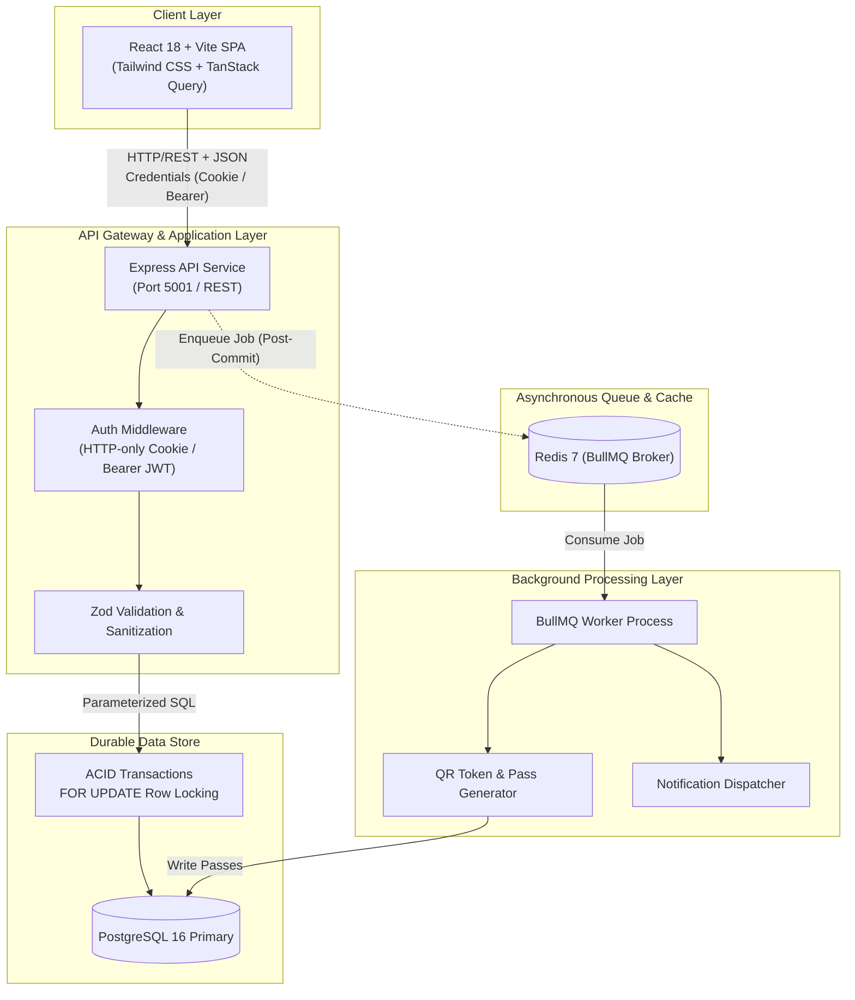

# Festo — College Event Ecosystem

Festo is an end-to-end college event ecosystem designed for discovering, hosting, and attending campus events. It replaces fragmented social media flyers and chaotic spreadsheet check-ins with an enterprise-grade, concurrency-safe architecture: publish verified events, reserve ticket capacity with zero-overselling guarantees, issue cryptographically verifiable QR passes, and streamline venue door check-ins.

---

## Architecture Overview

Festo is architected as a **Modular Monolith** with decoupled runtime processes. The HTTP API service and the Background Worker share a single Node.js codebase and database domain models, but execute as distinct, independently scalable container workloads.



### Core Architectural Pillars

#### 1. Concurrency Control & Zero Overselling Guarantee
Ticket reservation is sensitive to race conditions when multiple students attempt to claim limited capacity simultaneously.
- **Pessimistic Row-Level Locking:** During registration, Festo opens an atomic PostgreSQL transaction and locks the event row using `SELECT ... FOR UPDATE`.
- **Atomic Capacity Checks:** The API checks `(capacity - registered_count >= requested_quantity)` under the lock. If satisfied, it updates `registered_count` and commits the registration in the same transaction.
- **Post-Commit Queueing:** To prevent orphaned queue jobs from aborted transactions, ticket generation jobs are enqueued to Redis only *after* the PostgreSQL transaction commits successfully.

#### 2. Decoupled Asynchronous Processing
- Resource-intensive cryptographic operations (generating signed QR tokens, digital pass rendering, and notifications) are offloaded to **BullMQ** running on **Redis**.
- The API responds immediately to the user with a `confirmed` registration status while the worker fulfills pass generation in the background.
- Frontend polls or invalidates TanStack Query caches to seamlessly transition passes from `generating` to `ready`.

#### 3. Dual-Mode Authentication & Security Architecture
- **Dual-Token Handshake:** Primary authentication utilizes secure `HTTP-only`, `SameSite=Lax` cookies (`festo_token`) to safeguard against XSS token leakage. For development environments spanning multiple origins (`localhost` vs `127.0.0.1`), an Axios interceptor also synchronizes a fallback Bearer token.
- **Password Security:** Hashes passwords with `Argon2id` utilizing dedicated salt rounds.
- **Input Sanitization:** All inbound route parameters, query strings, and payloads are parsed and validated via strict **Zod** schemas before reaching controller logic.
- **Safe SQL Execution:** Parameterized queries via the native `pg` client completely prevent SQL injection.

#### 4. Modern Glassmorphic Frontend System
- Built on **React 18**, **Vite**, **Tailwind CSS**, and **Lucide Icons**.
- Implements a modern dark aesthetic (deep obsidian `#09070d`, fuchsia glows, and ambient violet light cones).
- Components include an interactive bento event grid, responsive collapsible sidebar (`AppSidebar`), searchable selector with a curated catalog of Indian colleges and cities (`SearchableSelect`), and live event poster upload previews with preset fallback banners.

---

## Relational Data Model

```text
┌─────────────────┐       ┌─────────────────┐
│     colleges    │       │      users      │
├─────────────────┤       ├─────────────────┤
│ id (PK)         │◄──┐   │ id (PK)         │
│ name            │   └───┤ college_id (FK) │
│ slug            │       │ email           │
│ city            │       │ password_hash   │
│ verified        │       │ role            │
└────────┬────────┘       └────────┬────────┘
         │                         │
         │                         │
         ▼                         ▼
┌───────────────────────────────────────────┐
│                   events                  │
├───────────────────────────────────────────┤
│ id (PK)                                   │
│ college_id (FK) ──► colleges.id           │
│ organizer_id (FK) ──► users.id            │
│ title, slug, description, category        │
│ start_date, end_date, venue               │
│ capacity, registered_count                │
│ poster_url, status                        │
└─────────────────────┬─────────────────────┘
                      │
                      ▼
┌───────────────────────────────────────────┐       ┌────────────────────────┐
│               registrations               │       │         passes         │
├───────────────────────────────────────────┤       ├────────────────────────┤
│ id (PK)                                   │◄──────┤ registration_id (FK)   │
│ event_id (FK) ──► events.id               │       │ event_id (FK)          │
│ user_id (FK) ──► users.id                 │       │ qr_code_token          │
│ quantity (1-10)                           │       │ status (issued/used)   │
│ status (confirmed/cancelled)              │       │ checked_in_at          │
└───────────────────────────────────────────┘       └────────────────────────┘
```

---

## Tech Stack

| Area | Technologies |
| --- | --- |
| **Frontend** | React 18, Vite, React Router v6, TanStack Query (v5), Axios, Tailwind CSS, Lucide React |
| **Backend API** | Node.js (ESM), Express.js, Zod, Argon2id, JSON Web Tokens (JWT) |
| **Data & Storage** | PostgreSQL 16, native `pg` driver, parameterized SQL, `node-pg-migrate` |
| **Task Queue & Cache** | Redis 7, BullMQ |
| **Containerization** | Docker, Docker Compose |

---

## Key Features

- **Event Discovery & Filtering:** Browse campus festivals, hackathons, workshops, and cultural fests with category chips and city/college filters.
- **Event Hosting Portal:** Fast publishing flow allowing verified users to host events, customize schedules, select banners from device upload or high-res presets, and allocate ticket capacities.
- **Capacity-Guaranteed Registration:** Supports bulk ticket claims (1–10 tickets) backed by database-level row locking to prevent overselling.
- **Digital Pass Wallet:** Mobile-optimized pass viewer displaying secure QR codes for smooth door check-in.
- **Organizer Dashboard & Metrics:** Real-time event registration tracking, attendee breakdowns, and check-in auditing.

---

## Local Development Setup

### Prerequisites
- [Docker](https://www.docker.com/) and Docker Compose
- [Node.js](https://nodejs.org/) (v18+ recommended)
- `npm`

### 1. Start Backend Stack
From the repository root:
```bash
cd festo-backend

# Start Postgres, Redis, Express API, and BullMQ worker containers
docker compose up -d --build postgres redis api worker

# Execute database migrations
docker compose exec -T api npm run migrate:up

# Seed colleges and 34 demo events across 17 categories
docker compose exec -T api npm run seed
```

The API service will be accessible at `http://localhost:5001`. Health check endpoint: `http://localhost:5001/health`.

### 2. Start Frontend SPA
From another terminal:
```bash
cd festo-frontend

# Install dependencies
npm install

# Start Vite development server
npm run dev
```

Open the printed Vite URL (typically `http://localhost:5173` or `http://localhost:5174`).

---

## Security & Secrets Policy

- **Zero Secret Ingestion:** Environment files (`.env`, `.env.*`), private cookies (`*.cookie`, `cookies.txt`), SSL keys (`*.pem`, `*.key`), and local logs (`*.log`) are strictly excluded via `.gitignore`.
- **Environment Templates:** Refer to `festo-backend/.env.example` and `festo-frontend/.env.example` when provisioning new staging or production environments. Never commit production secrets or service keys to git.

---

## Documentation

- [Backend Engineering Guide](festo-backend/README.md)
- [Frontend Engineering Guide](festo-frontend/README.md)
