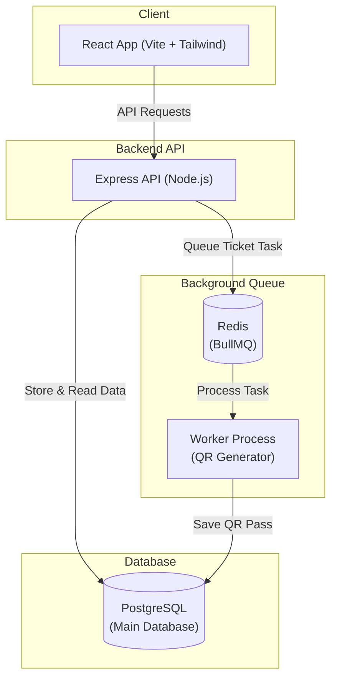

# Festo — College Event Platform

Festo is a modern web platform for college events. It helps students discover campus fests, register for tickets, and allows organizers to publish events with real-time capacity control and QR code passes.

---

## Architecture Flow

Festo uses a simple and reliable architecture: the frontend talks to a backend API, which securely stores data in PostgreSQL and uses a background worker for generating QR tickets.



### How It Works

1. **Browse & Select**: Students explore live college events and choose how many tickets they want.
2. **Safe Booking (No Overselling)**: The backend checks available seats inside a database transaction to make sure two people cannot book the last seat at the same time.
3. **Instant Confirmation**: Once registered, the user gets instant confirmation.
4. **Background QR Generation**: A background worker generates the unique QR pass and adds it to the user's ticket wallet.

---

## Tech Stack

| Layer | Technology |
| --- | --- |
| **Frontend** | React, Vite, Tailwind CSS |
| **Backend** | Node.js, Express |
| **Database** | PostgreSQL |
| **Background Jobs** | Redis, BullMQ |
| **Containerization** | Docker Compose |

---

## Key Features

- **Event Discovery**: Explore upcoming cultural fests, hackathons, and workshops by category or college.
- **Host an Event**: College organizers can create events, upload banners, and set seat capacity.
- **Safe Ticket Booking**: Book 1 to 10 tickets per event with guaranteed capacity checks.
- **QR Code Passes**: Digital tickets with scannable QR codes for fast venue entry.
- **Student Dashboard**: Simple wallet to view registrations and active passes.

---

## Quick Start (Run Locally)

### 1. Start Backend Services
Make sure you have Docker running, then run:

```bash
cd festo-backend
docker compose up -d --build postgres redis api worker
docker compose exec -T api npm run migrate:up
docker compose exec -T api npm run seed
```
The API will run at `http://localhost:5001`.

### 2. Start Frontend
In a new terminal window:

```bash
cd festo-frontend
npm install
npm run dev
```
Open `http://localhost:5173` in your browser.

---

## Security

- Environment files (`.env`) and private keys are strictly kept local and never committed to GitHub.
- Passwords are securely hashed.
- Protected routes require user authentication.
